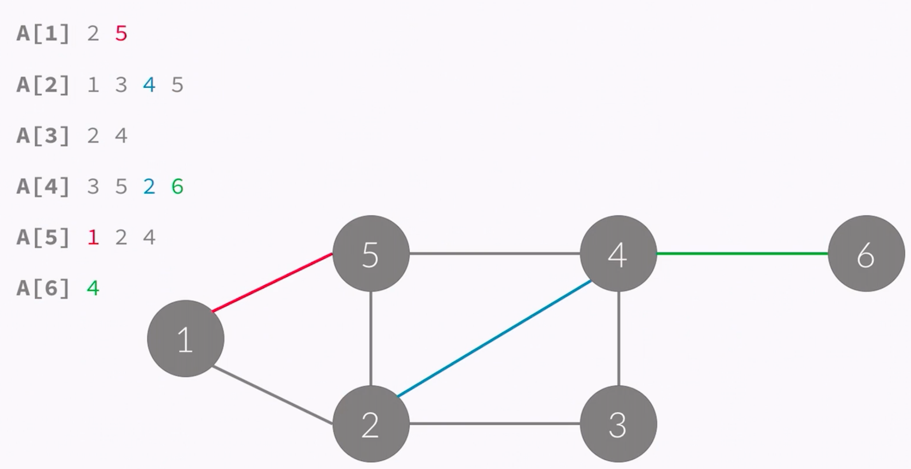

### 알고리즘 그래프

정점: 동그라미 

간선 : 동그라미를 잇는 선을 말한다.


### 그래프를 표현하는 방법

1. 인접행렬

   * 잘 사용하지 않음 

   * 필요없는 부분도 저장하기 때문에(주로 쉬운 문제 풀때 활용)

   * n(노드 숫자), m(간선 숫자)

   * ```java
     //양방향 그래프일 경우
     a[u][v] = a[v][u] = 1;
     ```

   * 가중치가 있는 그래프일 경우 

   * ```java
     //(i->j 간선이 있을 때, 그 가중치), 0(없을 때)
     //간선 가중치 범위가 0<=w 이면 없으면 -1을 저장 
     a[i][j] = w
     ```

   * 

2. 인접 리스트 (Adjacency-list)

   * 링크드 리스트를 이용해서 구현한다.
   * 대부분의 경우 사용한다.
   * A[i] = i 와 연결된 정점을 링크드 리스트로 포함하고 있음 
   * 
   * 인접리스트는 간선이 모두 한 번씩 저장된다.
   * 총 필요한 공간의 개수는 간선의 개수만큼 이다.
   * 그러나 링크드 리스트는 구현하는데 시간이 오래걸리기 때문에 주로 벡터와 같이 길이를 변경할 수 있는 배열을 이요해서 구현한다.
   * 


- 두 방식의 공간 복잡도
  - 인접행렬 : O(V^2)
  - 인접리스트: O(E)

 주로 간선의 개수가 정점의 개수보다 적은 문제가 출제되기 때문에 인접리스트를 사용하는 것 이 조금 더 유리하다고 할 수 있다.

3. 간선리스트(Edge - list)
   * 배열을 이용해서 구현한다.
   * 간선을 모두 저장하고 있다
   * E라는 배열에 간선을 모두 저장
   * 공간 복잡도 O(E)

***

### 그래프의 탐색 

[그래프의 탐색 좋은 설명]([https://nobilitycat.tistory.com/entry/%EA%B9%8A%EC%9D%B4-%EC%9A%B0%EC%84%A0-%ED%83%90%EC%83%89-DFS-%EC%9D%B8%EC%A0%91-%ED%96%89%EB%A0%AC-%EC%9D%B8%EC%A0%91-%EB%A6%AC%EC%8A%A4%ED%8A%B8](https://nobilitycat.tistory.com/entry/깊이-우선-탐색-DFS-인접-행렬-인접-리스트))

* 목적: 모든 정점을 1번씩 방문 

1. DFS: 깊이 우선 탐색 --> 최대한 많이 깊숙히 간다 : 스택 사용

   * 방문하면 스택에 넣는다 / 특별한 조건사항이 없으면 우리끼리의 약속으로 갈 수 있는 번호 중에서 작은 번호로 이동한다 

   * 방문할 곳이 없으면 스택에서 빼서(POP) 이전 정점으로 이동해야 한다. 

   * 마지막에는 전부 POP 하여 원래 정점으로 돌아감 

   * 스택이 비면 탐색 종료

   * 스택을 이용해서 갈 수 있는 만큼 최대한 많이 가고

   * 갈 수 없으면 이전 정점으로 돌아간다

   * 재귀 호출을 이용해서 구현할 수 있다.

   * dfs(x): x를 방문했다는 것을 의미한다

   * ```c
     void dfs(int x) {
       //방문했으면 더 이상 방문하면 안되니까 check를 트루로 바꿔준다
       check[x] = true;
       //dfs 순서를 알기위해서 출력을 일단 하나 해 봄
       pritnf("%d ", x);
       
       //다음 정점을 찾는 과정, n은 정점의 개수
       for(int i=1; i<=n; i++){
         
         //간선이 있고 x-->i , 아직 방문한 적이 없는지
         if(a[x][i] == 1 && check[i] == false){
           //i를 방문해 준다
           dfs(i);
         }
       }
     }
     ```

   * dfs는 모든 정점을 방문해야 하기 때문에 간선의 개수가 V면 O(V)이다. 

   * 그런데 인접행렬을 이용해서 구현하면 V * O(V) 이기 때문에 O(V^2)가 된다.

   * ```c
     void dfs(int x){
       check[x] = true;
       printf("%d", x);
       
       //a[x]에는 a와 연결된 정점이 모두 저장되어 있다
       for(int i=0; i<a[x].size(); i++){
         int y = a[x][i];
         if(check[y] == false){
           dfs(y);
         }
       }
     }
     ```


   ***

   

2. BFS: 너비 우선 탐색 --> 최대한 넓게 간다 : 큐 사용 

   * 모든 가중치가 1일 경우 최단거리를 찾는 문제가 된다

   * 큐를 이용해서 지금 위치에서 갈 수 있는 것을 모두 큐에 넣는 방식

   * 큐에 넣을 때 방문했다고 체크해야 한다.

   * 1에서 갈 수 있는것을 큐에 넣어준 후  check배열에 체크, 더 이상 1에서 갈 수 있는 곳이 없으면 1을 pop 해준다

   * 

     

   * 다음 정점으로 이동 그 다음 정점에서 갈 수 있는곳 큐에 넣어주고 체크를 바꿔줌

   * 방문이 끝나면 마찬가지로 pop 

   * 마지막으로 큐는 비게 된다.

   * ``` c
     //인접행렬의 경우
     
     queue<int> q;
     //시작점을 우선 큐 안에다 넣는다
     check[1] = true; 
     q.push(1);
     
     while(!q.empty()){
       //큐의 제일 앞에 있는 x를 뺀다
       int x = q.front();
       q.pop();
       printf("%d ", x);
       for(int i=1; i<=n; i++){
         //x의 다음 정점을 찾는 코드
         if(a[x][i] == 1 && check[i] == false){
           check[i] = true;
           q.push(i);
         }
       }
     }
     ```

   * ```c
     //인접 리스트의 경우
     queue<int> q;
     check[1] = true;
     q.push(1);
     
     while(!q.empty()){
       int x = q.front();
       q.pop();
       printf("%d", x);
       
       for(int i=0; i<a[x].size(); i++){
         int y = a[x][i];
         if(check[y]==false){
           check[y] = true;
           q.push(y);
         }
       }
       
     }
     ```


```java
import java.util.*;

public class Main {
  
    static ArrayList<Integer>[] a;
    static boolean[] c;
  
  
    public static void dfs(int x) {
        if (c[x]) {
            return;
        }
        c[x] = true;
        System.out.print(x + " ");
        for (int y : a[x]) {
            if (c[y] == false) {
                dfs(y);
            }
        }
    }
  
    public static void bfs(int start) {
        Queue<Integer> q = new LinkedList<Integer>();
       //시작점을 큐에 넣고, 체크도 해준다.
      	q.add(start);
        c[start] = true;
      	
      	//큐가 비어있지 않다면 x로 해당 정점을 빼서 
        while (!q.isEmpty()) {
            int x = q.remove();
            System.out.print(x + " ");
          
          	//다음 정점을 찾아 큐에 더해 준다
            for (int y : a[x]) {
                if (c[y] == false) {
                  
                  //true로 바꿔주고 큐에 넣어준다.
                  c[y] = true;  
                  q.add(y);
                }
            }
        }
    }
    public static void main(String args[]) {
        Scanner sc = new Scanner(System.in);
        int n = sc.nextInt();
        int m = sc.nextInt();
        int start = sc.nextInt();
      
        a = (ArrayList<Integer>[]) new ArrayList[n+1];
        for (int i=1; i<=n; i++) {
            a[i] = new ArrayList<Integer>();
        }
        for (int i=0; i<m; i++) {
            int u = sc.nextInt();
            int v = sc.nextInt();
            a[u].add(v);
            a[v].add(u);
        }
        for (int i=1; i<=n; i++) {
            Collections.sort(a[i]);
        }
        c = new boolean[n+1];
        dfs(start);
        System.out.println();
        c = new boolean[n+1];
        bfs(start);
        System.out.println();
    }
}
```


